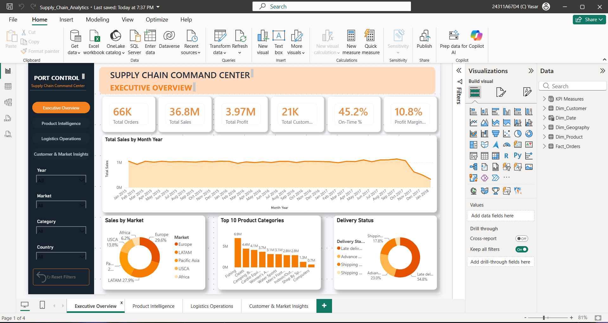
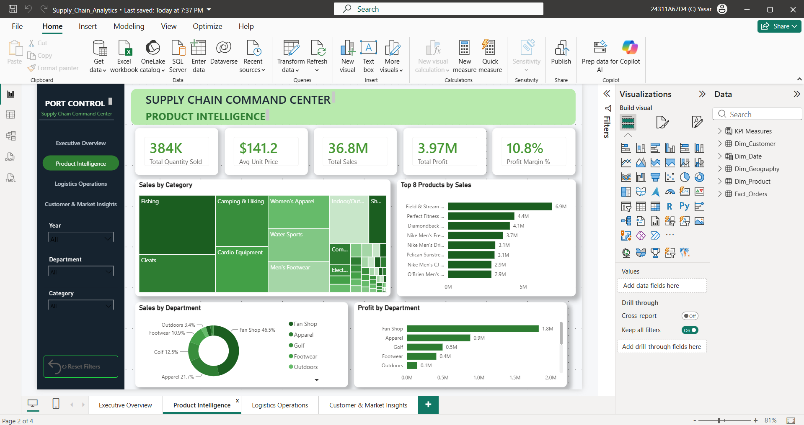
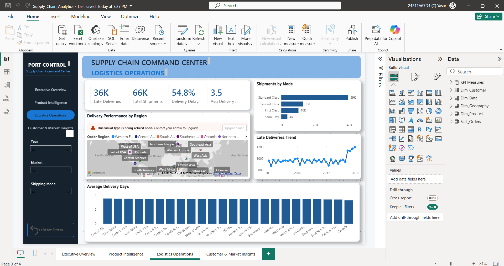
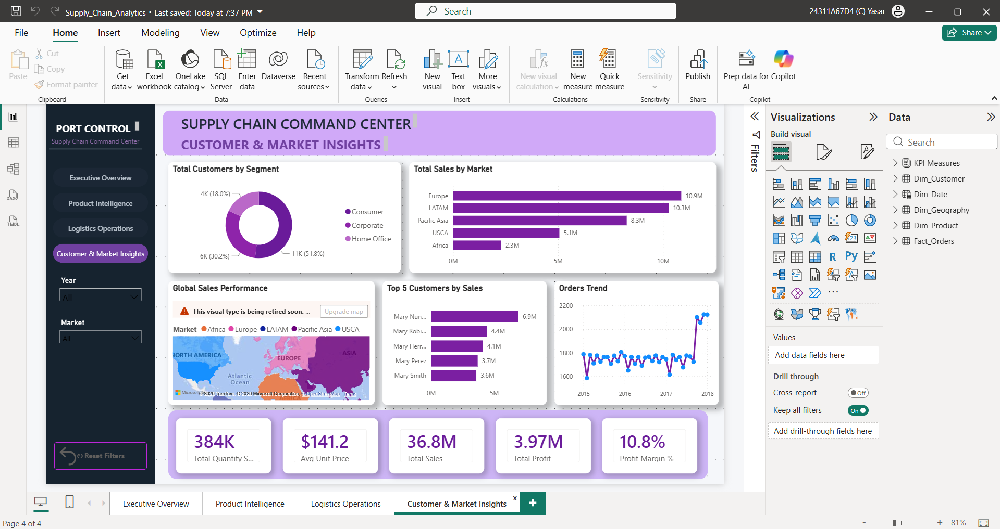

# 🚚 Supply Chain Command Center – Power BI Dashboard

An interactive Power BI dashboard designed to analyze and monitor key supply chain operations, including sales, profitability, product performance, logistics, customers, and market trends.

The dashboard provides business-focused insights to help management and operational teams make data-driven decisions.

---

# 📊 Dashboard Preview

### 📌 Page 1 – Executive Overview


### 📦 Page 2 – Product Intelligence


### 🚚 Page 3 – Logistics Operations


### 🌍 Page 4 – Customer & Market Insights


---

# 🎯 Project Objective

The objective of this project is to transform raw supply chain data into an interactive business intelligence dashboard that helps organizations:

- Monitor overall business performance
- Analyze sales and profitability
- Identify high-performing products and categories
- Evaluate logistics and delivery performance
- Understand customer and market behavior
- Identify potential areas for operational improvement

---

# 🏢 Business Problems

Supply chain operations involve multiple areas such as orders, products, customers, markets, and logistics. Without a centralized analytical dashboard, it can be difficult for business teams to identify operational problems and performance trends.

This project addresses the following business problems:

### 1. Lack of Overall Performance Visibility
**Problem:**  
Management needs a quick way to monitor orders, sales, profit, delivery performance, and shipping costs.

**Solution:**  
The Executive Overview provides centralized KPI cards and trend analysis for monitoring overall business performance.

---

### 2. Difficulty Identifying Product Performance
**Problem:**  
Businesses need to identify which products, categories, and departments generate strong sales and profitability.

**Solution:**  
The Product Intelligence page analyzes product and category performance, helping identify high-performing and underperforming products.

---

### 3. Delivery Delays and Logistics Issues
**Problem:**  
Late deliveries can affect customer satisfaction and increase operational costs. It can be difficult to identify where delays are occurring.

**Solution:**  
The Logistics Operations page analyzes delivery time, late deliveries, shipping modes, regions, and logistics trends to identify areas requiring operational attention.

---

### 4. Limited Customer and Market Visibility
**Problem:**  
Different markets and customers can contribute differently to overall business performance.

**Solution:**  
The Customer & Market Insights page provides market and customer-level analysis to identify important sales and profitability patterns.

---

### 5. Difficulty Exploring Data
**Problem:**  
Static reports make it difficult for users to investigate specific markets, years, categories, departments, or shipping modes.

**Solution:**  
Interactive slicers, page navigation, and Reset Filters functionality allow users to dynamically explore the data.

---

# 💼 Business Value

The dashboard helps decision-makers:

- Monitor business performance from a single interface
- Identify profitable and underperforming products
- Detect delivery and logistics issues
- Compare market performance
- Analyze customer behavior
- Investigate performance using interactive filters
- Support data-driven operational decisions

---

# 📊 Dashboard Pages & Key Metrics

### 1. Executive Overview

Provides a high-level view of overall supply chain and business performance.

**Key Metrics:**
- Total Orders
- Total Revenue
- Total Profit
- On-Time Delivery %
- Average Delivery Time
- Average Shipping Cost

**Key Analysis:**
- Monthly Revenue Trend
- Orders by Region/Market
- Delivery Status
- Category Performance
- Top Customers

---

### 2. Product Intelligence

Focuses on product, category, and department performance.

**Key Metrics:**
- Total Sales
- Total Profit
- Total Orders
- Average Order Value
- Total Discount Amount

**Key Analysis:**
- Sales by Category
- Profit by Category
- Top Products
- Department Performance
- Product-level Performance

---

### 3. Logistics Operations

Analyzes shipping, delivery, and logistics performance.

**Key Metrics:**
- Total Shipments
- Late Deliveries
- Average Delivery Days
- On-Time Delivery %
- Average Shipping Cost

**Key Analysis:**
- Delivery Performance by Region
- Shipping Mode Performance
- Delay Trends
- Regional Logistics Performance
- Delivery Time Analysis

---

### 4. Customer & Market Insights

Analyzes customer behavior and market-level business performance.

**Key Metrics:**
- Total Customers
- Total Orders
- Total Sales
- Total Profit
- Average Order Value

**Key Analysis:**
- Customer Performance
- Sales by Market
- Profit by Market
- Order Trends
- Customer and Market Segmentation

---

# 🛠️ Tools & Technologies

- 📊 Power BI
- 🔄 Power Query
- 🧮 DAX
- 🏗️ Data Modeling
- 📈 Data Visualization
- 📄 Microsoft Excel / CSV

---

# 🧹 Data Preparation

Power Query was used to prepare and transform the raw supply chain dataset.

The preparation process included:

- Data cleaning
- Data type correction
- Handling missing values
- Creating calculated columns
- Creating date-related fields
- Preparing dimension tables
- Building relationships between tables

---

# 🏗️ Data Model

The dashboard uses a structured data model consisting of:

- `Fact_Orders`
- `Dim_Customer`
- `Dim_Product`
- `Dim_Date`
- `Dim_Geography`
- KPI Measures

The model follows a dimensional **star-schema approach** to improve analysis and maintain relationships between business entities.

---

# 📐 DAX & Measures

DAX measures were created to calculate important business KPIs such as:

- Total Orders
- Total Sales
- Total Profit
- On-Time Delivery %
- Average Delivery Days
- Average Shipping Cost
- Loss Orders
- Total Discount Amount

These measures enable dynamic calculations based on user-selected filters and dashboard interactions.

---

# 🎛️ Interactive Features

The dashboard includes:

- Interactive slicers
- Year filtering
- Market filtering
- Category filtering
- Country filtering
- Department filtering
- Shipping mode filtering
- Reset Filters buttons
- Page navigation
- Interactive charts and KPI cards

Users can dynamically filter the dashboard and analyze different areas of the supply chain.

---

# 💡 Business Insights

The dashboard helps business users identify:

- 📈 Changes in sales and revenue trends
- 💰 Profitable and loss-making products
- 📦 High-performing product categories
- 🚚 Delivery delays and logistics issues
- 🌍 Market-level performance differences
- 👥 Customer purchasing patterns
- 🎯 Areas requiring operational attention

---

# 📊 Key Business Findings

- The business generated **$36.8M in total sales** and **$3.97M in total profit**, with a **10.8% profit margin**.

- **Europe ($10.9M)** and **LATAM ($10.3M)** were the top-performing markets by sales.

- **Fishing ($6.9M)** was the highest-performing product category, making it a major sales driver.

- **Fan Shop** was the strongest department, contributing **46.5% of department sales** and generating approximately **$1.8M in profit**.

- Logistics performance requires attention, with approximately **36K late deliveries out of 66K total shipments** and a **54.8% delivery delay rate**.

- **Standard Class handled 39K shipments**, making it the most important shipping mode for logistics optimization.

- The **Consumer segment represented 58.1% of customers**, while order volume increased significantly toward the end of the analysis period.

---

# 💡 Business Recommendations

- Prioritize reducing late deliveries by improving carrier, warehouse, and shipping operations.
- Focus on optimizing **Standard Class**, as it handles the largest shipment volume.
- Continue investing in high-performing markets such as **Europe and LATAM**.
- Maintain strong inventory and marketing strategies for high-performing categories like **Fishing**.
- Review lower-performing departments and optimize pricing, costs, and product strategies.
- Strengthen customer retention strategies for the large Consumer customer segment.

---

# 📌 Project Conclusion

The Supply Chain Command Center transforms raw supply chain data into an interactive Business Intelligence solution for monitoring sales, profitability, products, logistics, customers, and markets.

The analysis revealed strong sales performance, with Europe and LATAM emerging as the leading markets. Fishing was identified as the top-performing product category, while Fan Shop made the strongest contribution to department sales and profitability.

The logistics analysis also highlighted an important operational challenge, with a significant number of late deliveries. Standard Class handled the largest shipment volume, making logistics optimization a key opportunity for improving delivery performance.

Overall, this project demonstrates how Power BI can transform raw business data into actionable insights that support performance monitoring, operational improvement, and data-driven decision-making.

---

# 📁 Project Structure

```text
Supply-Chain-Command-Center/
│
├── README.md
│
├── PowerBI/
│   └── Supply_Chain_Analytics.pbix
│
└── Screenshots/
    ├── Page-1.png
    ├── Page-2.png
    ├── Page-3.png
    └── Page-4.png
```

---

# 🔗 Connect With Me

- 💼 **LinkedIn:** [Yasar Mohammed](https://www.linkedin.com/in/yasar-mohammed-73s96)
- 💻 **GitHub:** [mdyasar120-dot](https://github.com/mdyasar120-dot)

---

⭐ If you found this project useful, consider giving the repository a star!
